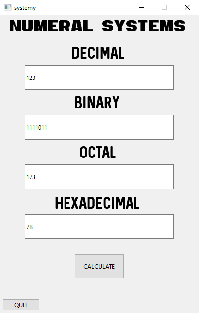
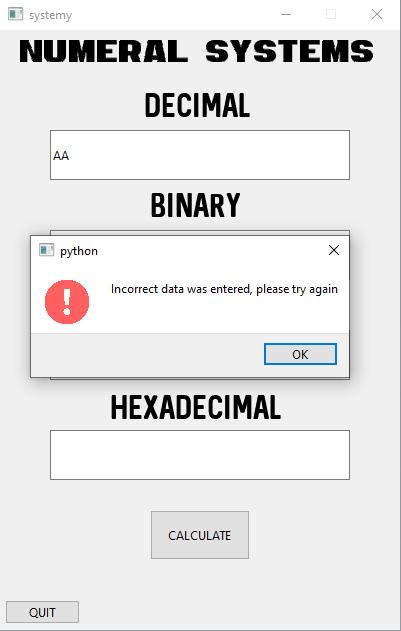
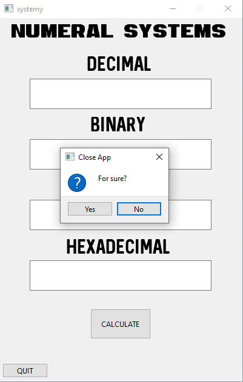

# NUMERAL SYSTEMS CALCULATOR

## About 
The aplication was created in Python with use of PySide6 and was made to learn and practice basic programming skills.

## Description

The application presents a simple calculator which allows to convert the entered number into other number systems.
The implemented systems:
- decimal
- binary
- octal
- hexadecimal

The program does not use ready-made functions to change values to other systems, but they were written by me ([to_dec](./to_dec.py), [from_dec](./from_dec.py), in order to practice programming.
The application is capable of detecting where data has been entered and then converting it to other systems, additionally the program detects wrongly entered data, and in the case of the hexadecimal system accepts the entry of small and large characters (A-F).

## Screens

The first image shows the program running, the second shows the information about wrong data input, the third image shows the situation when the user wants to close the application.

	
 
 

## License

This project is licensed under the terms of **the MIT license**.
You can check out the full license [here](./LICENSE)
